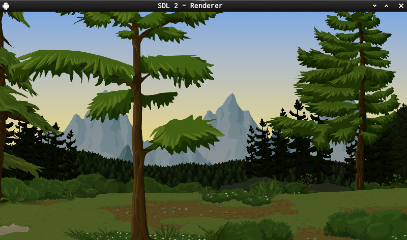
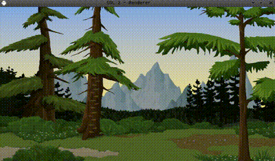

SDL2-Parallax-02

- moving layered backgrounds with arrow keys.

Assets taken from <http://www.glitchthegame.com/public-domain-game-art/>

## Useful links

[SDL2](https://www.libsdl.org/) | [SDL-Discourse](https://discourse.libsdl.org) | [My Example Code](https://acry.github.io/SDL2-C.html)

## Contact

[Get in touch](https://acry.github.io/#contact)
